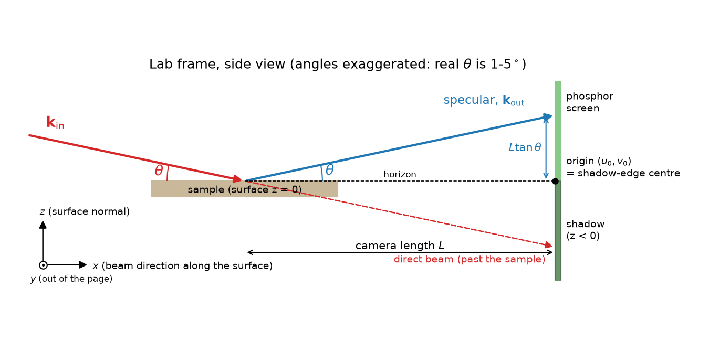
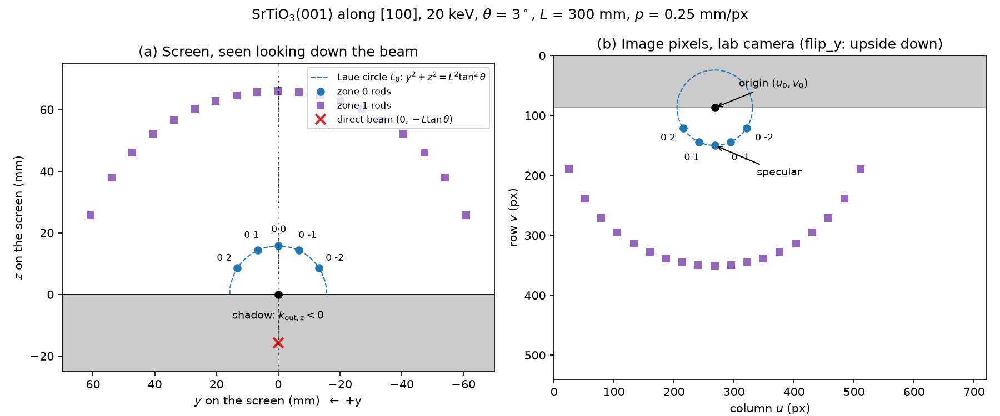
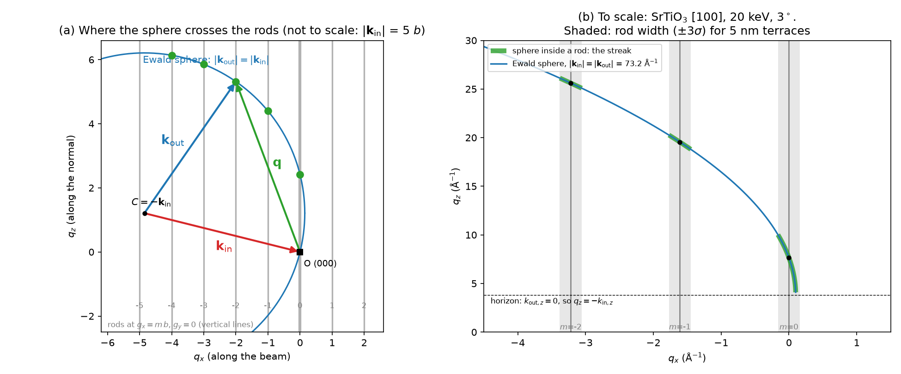
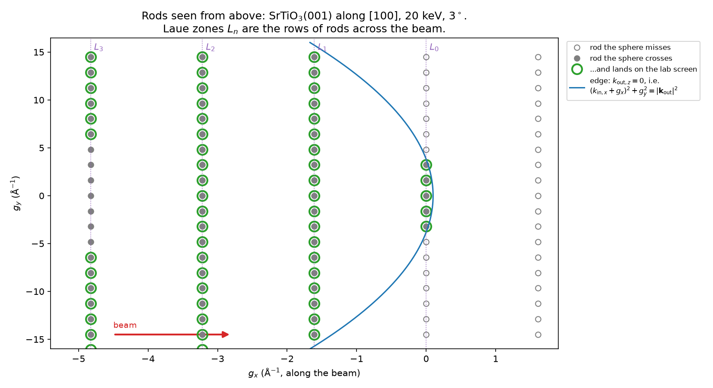
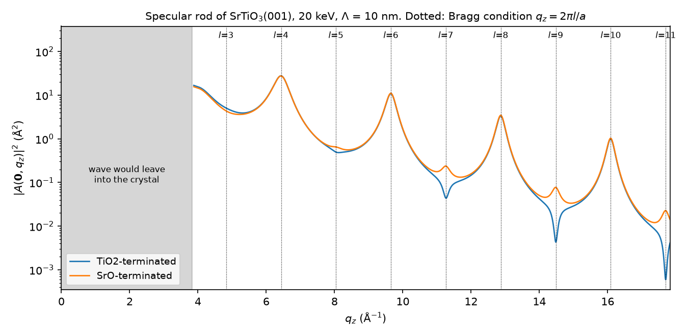
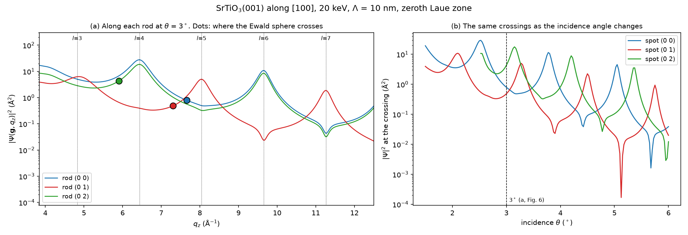
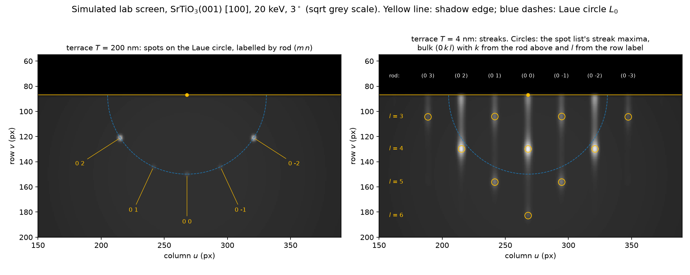

# RHEED simulation: the equations

What `lumi.rheedsim` computes, step by step, where each step lives in the code, and
where each equation comes from. The model is **kinematic** (single scattering). Spot
and streak **positions** are exact geometry. **Intensities** are qualitative: see
[What it leaves out](#13-what-it-leaves-out).

Each section ends with a **Source** line:

- **textbook**: standard theory. Read it in the [references](#14-references).
- **modelling choice**: a simplification made for this code, not taken from a paper.

The figures are drawn by `docs/scripts/plot_rheed_docs.py`, mostly by running the simulator
itself; rerun it after changing the code.

Contents:

0. [Symbols](#0-symbols)
1. [Units and frames](#1-units-and-frames)
2. [The electron](#2-the-electron)
3. [The screen: pixel ↔ outgoing wavevector](#3-the-screen-pixel--outgoing-wavevector)
4. [The crystal and its surface cell](#4-the-crystal-and-its-surface-cell)
5. [The Ewald sphere and the rods (the spot list)](#5-the-ewald-sphere-and-the-rods-the-spot-list)
6. [Intensity along a rod](#6-intensity-along-a-rod)
7. [From rods to a picture: streaks](#7-from-rods-to-a-picture-streaks)
8. [Reconstructions](#8-reconstructions)
9. [3D islands: transmission spots](#9-3d-islands-transmission-spots)
10. [Composing the image](#10-composing-the-image)
11. [Labels](#11-labels)
12. [Worked example](#12-worked-example)
13. [What it leaves out](#13-what-it-leaves-out)
14. [References](#14-references)
15. [Code map](#15-code-map)

---

## 0. Symbols

Every symbol used below, grouped by where it first appears. "Request field" is the name
in `RheedSimRequest` (`lumi/contracts/payloads/simulation.py`) when the user sets it.

**Constants and the beam**

| Symbol | Meaning | Unit | Request field |
|---|---|---|---|
| $h_\mathrm{P}$ | Planck constant | J s | |
| $m_0$ | electron rest mass | kg | |
| $e$ | elementary charge | C | |
| $c_0$ | speed of light | m/s | |
| $E$ | beam energy (accelerating voltage × $e$) | keV | `beam.energy_kev`; unset = the lab's `rheed.energy_kev` (25 keV) |
| $\lambda$ | electron wavelength | Å | |
| $\lvert\mathbf k_\text{in}\rvert,\ \lvert\mathbf k_\text{out}\rvert$ | wavenumber $2\pi/\lambda$; the two are equal because scattering is elastic | Å⁻¹ | |
| $\theta$ | glancing angle of incidence, from the surface plane | rad | `beam.incidence_deg` |
| $\delta$ | beam divergence | rad | `beam.divergence_mrad` |
| $\mathbf k_\text{in}$, $\mathbf k_\text{out}$ | incident / scattered wavevector; $\lvert\mathbf k_\text{in}\rvert = \lvert\mathbf k_\text{out}\rvert = k$ | Å⁻¹ | |
| $\mathbf q$ | momentum transfer $\mathbf k_\text{out}-\mathbf k_\text{in}$ | Å⁻¹ | |
| $k_{\text{in},x}, k_{\text{in},z}$ | lab components of $\mathbf k_\text{in}$: $\lvert\mathbf k_\text{in}\rvert\cos\theta$ and $-\lvert\mathbf k_\text{in}\rvert\sin\theta$ ($k_{\text{in},y}=0$) | Å⁻¹ | |
| $k_{\text{out},x}, k_{\text{out},y}, k_{\text{out},z}$ | lab components of $\mathbf k_\text{out}$ | Å⁻¹ | |
| $\mathbf q_\parallel$, $q_z$ | in-plane part and normal part of $\mathbf q$; on a rod, $q_z$ is where the Ewald sphere crosses it (§5) | Å⁻¹ | |
| $s$ | $\sin\vartheta/\lambda = \lvert\mathbf q\rvert/4\pi$, with $2\vartheta$ the scattering angle | Å⁻¹ | |

**Lab frame and screen**

| Symbol | Meaning | Unit | Request field |
|---|---|---|---|
| $\hat x, \hat y, \hat z$ | lab axes: beam direction along the surface, $\hat z\times\hat x$, outward normal | | |
| $L$ | camera length, sample to screen | mm | `screen.camera_length_mm` |
| $y, z$ | position on the screen (lab $y$ and $z$) | mm | |
| $p$ | size of one image pixel, measured on the screen | mm/px | `screen.pixel_size_mm` |
| $u, v$ | image column and row (row 0 at the top) | px | |
| $W, H$ | image width and height | px | `screen.width_px`, `height_px` |
| $(u_0, v_0)$ | image position of the origin (shadow-edge centre) | px | `screen.origin_x_px`, `origin_y_px` |
| $\rho$ | camera roll about the beam axis | rad | `screen.roll_deg` |
| $(y_b, z_b)$ | where the beam meets the sample, off the camera axis | mm | `beam.shift_y_mm`, `shift_z_mm` |
| $\Delta u', \Delta v'$ | pixel offsets from the origin before roll and flips | px | |
| $\Delta u, \Delta v$ | pixel offsets from the origin after roll and flips | px | |

**Crystal**

| Symbol | Meaning | Unit | Request field |
|---|---|---|---|
| $a, b, c, \alpha, \beta, \gamma$ | lattice parameters of the structure's (conventional) cell | Å, ° | `manual.lattice`, or the CIF |
| $\mathsf A$ | cell matrix; columns are $\mathbf a,\mathbf b,\mathbf c$ in Cartesian | Å | |
| $\mathsf A^*$ | reciprocal cell matrix, $2\pi(\mathsf A^{-1})^\mathsf{T}$ | Å⁻¹ | |
| $\mathbf x_j$, $\mathbf r_j$ | fractional and Cartesian position of atom $j$ | –, Å | `sites[].x,y,z` |
| $o_j$ | site occupancy | – | `sites[].occupancy` |
| $B_j$ | isotropic Debye–Waller factor, $8\pi^2U_\text{iso}$ | Ų | `sites[].b_iso`, else `morphology.debye_waller_b` |
| $(hkl)$ | surface plane, Miller indices | – | `surface.normal` |
| $[uvw]$ | beam direction along the surface, direct-lattice indices | – | `surface.azimuth` |
| $\mathbf G_{hkl}$ | reciprocal-lattice vector $\mathsf A^*(h,k,l)^\mathsf T$ | Å⁻¹ | |
| $\mathbf t$ | a lattice translation (fractional), including centring; $N_t$ of them per cell | – | |
| $V_p$ | primitive cell volume $\lvert\det\mathsf A\rvert/N_t$ | ų | |
| $\hat{\mathbf n}$ | outward unit surface normal | – | |
| $\mathbf a_1, \mathbf a_2$ | primitive surface mesh (in-plane lattice vectors) | Å | |
| $\mathbf a_3$ | stacking vector (climbs one plane spacing) | Å | |
| $d$ | height of one $\mathbf a_3$ repeat, $\mathbf a_3\cdot\hat{\mathbf n}$ | Å | |
| $\Omega$ | surface mesh area $(\mathbf a_1\times\mathbf a_2)\cdot\hat{\mathbf n}$ | Ų | |
| $\hat{\mathbf e}_x, \hat{\mathbf e}_y$ | in-plane unit vectors along $[uvw]$ and $\hat{\mathbf n}\times\hat{\mathbf e}_x$ | – | |
| $\phi$ | azimuth offset: the sample turned about $\hat{\mathbf n}$ | rad | `surface.azimuth_offset_deg` |
| $\mathsf R$ | rotation from crystal to lab frame | – | |
| $N_\text{layers}$ | number of $\mathbf a_3$ repeats summed in the slab | – | `morphology.layers` |

**Rods and scattering**

| Symbol | Meaning | Unit | Request field |
|---|---|---|---|
| $\mathbf b_1, \mathbf b_2$ | reciprocal surface mesh; $\mathbf b_i\cdot\mathbf a_j = 2\pi\delta_{ij}$ | Å⁻¹ | |
| $\mathsf B_\parallel$ | the matrix $[\mathbf b_1\ \mathbf b_2]$ in lab $(x,y)$ | Å⁻¹ | |
| $m, n$ | rod indices; $\mathbf g_{mn} = m\mathbf b_1 + n\mathbf b_2$ | – | |
| $\mathbf g = (g_x, g_y)$ | a rod's in-plane position (lab frame) | Å⁻¹ | |
| $\Psi(\mathbf g, q_z)$ | kinematic scattering amplitude of the slab along a rod | Å | |
| $f_j(s)$ | electron atomic scattering factor of atom $j$'s element | Å | |
| $\kappa_i, \eta_i$ | the 5-Gaussian fit coefficients of $f(s)$ | Å, Ų | |
| $\Lambda$ | inelastic mean free path | Å | `morphology.mean_free_path_nm` |
| $\alpha_\text{in}, \alpha_\text{out}$ | beam angle to the surface on the way in / out | rad | |
| $\mu$ | amplitude attenuation per unit depth | Å⁻¹ | |
| $T$ | terrace size (lateral coherence length) | Å | `morphology.terrace_nm` |
| $\sigma_x, \sigma_y$ | Gaussian width of a rod in-plane, along the beam and across it | Å⁻¹ | |
| $\sigma_z$ | width $\lvert\Psi\rvert^2$ is smoothed over along a rod (divergence) | Å⁻¹ | |
| $\mathsf J$ | a pixel's footprint in $\mathbf q_\parallel$: columns $\partial\mathbf q_\parallel/\partial u$, $\partial\mathbf q_\parallel/\partial v$ | Å⁻¹/px | |

**Reconstructions, islands and the image**

| Symbol | Meaning | Unit | Request field |
|---|---|---|---|
| $\mathsf M$ | reconstruction matrix (rows = supercell vectors in $\mathbf a_1,\mathbf a_2$ units) | – | `surface.reconstructions[].matrix` |
| $\boldsymbol\nu$ | integer indices of a superlattice rod | – | |
| $S$ | reconstruction strength | – | `reconstructions[].strength` |
| $D$ | island size | Å | `morphology.island_nm` |
| $F(\mathbf G)$ | bulk structure factor of one conventional cell | Å | |
| $\Sigma_i$ | Gaussian covariance of a transmission spot in $\mathbf q$ | Å⁻² | |
| $\varepsilon$ | excitation error, distance of $\mathbf G$ from the Ewald sphere | Å⁻¹ | |
| $\chi$ | share of the pattern from 3D islands | – | `morphology.islands` |
| $\Gamma$ | diffuse background level | – | `render.background` |
| $\sigma_b$ | blur (screen and camera point spread) | px | `render.blur_px` |
| $N_c$ | shot-noise counts at full scale | – | `render.noise_counts` |
| $I$, $\hat I$ | image intensity; $\hat I$ is divided by its own maximum | – | |
| $\ell_\text{row}$ | shortest lattice repeat along the beam | Å | |

---

## 1. Units and frames

Lengths in the crystal are Å and wavevectors are Å⁻¹ with the $2\pi$ included
($\lvert\mathbf k_\text{in}\rvert=2\pi/\lambda$). The screen is in mm, the image in pixels.

**Lab frame.** $\hat z$ is the outward surface normal and $\hat x$ is the beam's
direction along the surface. The surface is the plane $z=0$ and the crystal lies at
$z\le 0$ (Fig. 1).

**Crystal frame.** Cartesian, with $\mathbf a$ along $x$ and $\mathbf b$ in the $xy$
plane:

$$
\mathsf A = \begin{pmatrix}
a & b\cos\gamma & c\cos\beta \\
0 & b\sin\gamma & c\,\dfrac{\cos\alpha - \cos\beta\cos\gamma}{\sin\gamma} \\
0 & 0 & c\,\sqrt{1-\cos^2\beta-\left(\dfrac{\cos\alpha-\cos\beta\cos\gamma}{\sin\gamma}\right)^2}
\end{pmatrix},
\qquad \mathbf r = \mathsf A\,\mathbf x,
\qquad \mathsf A^* = 2\pi(\mathsf A^{-1})^\mathsf{T},
\qquad \mathbf G_{hkl} = \mathsf A^*(h,k,l)^\mathsf T
$$

Here $\mathbf x$ is an atom's fractional position and $\mathbf r$ its Cartesian one.

**Source:** textbook crystallography (any crystallography text; *International Tables*
Vol. B/C). The lab-frame conventions are this code's own.

## 2. The electron

$$
\lambda = \frac{h_\mathrm P}{\sqrt{2 m_0 e E \left(1 + \dfrac{eE}{2 m_0 c_0^2}\right)}},
\qquad \lvert\mathbf k_\text{in}\rvert = \lvert\mathbf k_\text{out}\rvert = \frac{2\pi}{\lambda},
\qquad \mathbf k_{\text{in}} = \lvert\mathbf k_\text{in}\rvert\,(\cos\theta,\; 0,\; -\sin\theta)
$$

The bracket is the relativistic correction; at 20 keV it changes $\lambda$ by about 1 %.
Scattering is elastic, so $\mathbf k_\text{in}$ and $\mathbf k_\text{out}$ have the same
length. Written out, $k_{\text{in},x}=\lvert\mathbf k_\text{in}\rvert\cos\theta$,
$k_{\text{in},y}=0$ and $k_{\text{in},z}=-\lvert\mathbf k_\text{in}\rvert\sin\theta$.
20 keV gives $\lambda = 0.08588$ Å and $\lvert\mathbf k_\text{in}\rvert = 73.16$ Å⁻¹. The incident beam travels along
$+x$, descending at the glancing angle $\theta$.

**Source:** textbook [WC09, IC04]. CODATA 2018 constants.

## 3. The screen: pixel ↔ outgoing wavevector

*Fig. 1. The beam hits the sample at glancing angle $\theta$. The specular beam leaves
at $\theta$ and lands $L\tan\theta$ above the origin, which is where the horizon meets
the screen. The direct beam (the part that misses the sample) lands $L\tan\theta$ below
it. Everything below the horizon is shadow.*

The screen is the plane $x = L$. The wave reaching screen point $(L, y, z)$ is

$$
\mathbf k_{\text{out}} = \frac{\lvert\mathbf k_\text{out}\rvert}{\sqrt{L^2+y^2+z^2}}\,(L,\; y,\; z),
\qquad
\mathbf q = \mathbf k_{\text{out}} - \mathbf k_{\text{in}}
$$

and conversely a wave along $\mathbf k_\text{out}$ lands at $(y, z) = L\,(k_{\text{out},y}, k_{\text{out},z})/k_{\text{out},x}$
(if $k_{\text{out},x}>0$). A pixel can be lit only if $k_{\text{out},z}>0$; a lower wave would have
to leave into the sample. That region is the **shadow**.

**Shifting the beam.** The equations above put the point where the beam meets the
sample on the camera axis. If the beam is moved sideways or up by $(y_b, z_b)$, every
ray starts from there instead, so a wave along $\mathbf k_\text{out}$ lands at

$$
(y, z) = (y_b, z_b) + L\,(k_{\text{out},y}, k_{\text{out},z})/k_{\text{out},x}
$$

The whole pattern moves rigidly by $(y_b, z_b)$: spots, shadow edge and direct beam
alike. Angles, and so spot spacings, don't change, and nor does $L$: the shift is square
to the beam. In the
image that is the origin moved by $(y_b, z_b)/p$ through the roll and flips below, and
the result's `origin_px` reports it. `screen` in the result keeps the origin you gave,
so it can be sent back unchanged.

**Screen → image.** Looking down the beam, $+y$ is to the left and $+z$ is up. Image
rows run downward. So:

$$
(\Delta u',\,\Delta v') = \left(-\frac{y}{p},\; -\frac{z}{p}\right),\qquad
\begin{pmatrix}\Delta u\\ \Delta v\end{pmatrix} =
\begin{pmatrix}\cos\rho & \sin\rho\\ -\sin\rho & \cos\rho\end{pmatrix}
\begin{pmatrix}\Delta u'\\ \Delta v'\end{pmatrix}
$$

Then the flips apply ($\Delta u\to-\Delta u$ for `flip_x`, $\Delta v\to-\Delta v$ for
`flip_y`), and $(u,v) = (u_0+\Delta u,\ v_0+\Delta v)$. The code inverts each step
exactly to go from a pixel to its $\mathbf q$.

*Fig. 2. The same simulated spots in both coordinate systems. (a) On the screen in mm,
looking down the beam. (b) In the lab camera's image, which sees the screen upside down
(`flip_y`). Blue: rods of the zeroth Laue zone on the circle through the specular spot.
Purple: the first zone. Grey: shadow.*

**Landmarks:**

| Landmark | Screen position $(y, z)$ |
|---|---|
| specular spot | $(0,\ L\tan\theta)$ |
| direct beam | $(0,\ -L\tan\theta)$ |
| shadow edge (horizon) | the line $z=0$ |

(each moved by $(y_b, z_b)$ when the beam is shifted)

**Source:** textbook geometry [IC04 ch. 2, Br99]. The pixel conventions (roll, flips,
origin, beam shift) are this code's.

## 4. The crystal and its surface cell

**Symmetry expansion.** Every space-group operation is applied to the asymmetric unit.
Images within 0.01 Å of an atom already placed are the same atom, which handles
special positions. Each site keeps its occupancy $o_j$, so a mixed La 0.7 / Sr 0.3 site
becomes two co-sited atoms. *(textbook)*

**The true lattice.** The code searches the atoms for every translation $\mathbf t$
that maps each atom onto one of the same element, $o_j$ and $B_j$. The lattice is
$\{\mathbf n+\mathbf t:\ \mathbf n\in\mathbb Z^3\}$, and $V_p = \lvert\det\mathsf
A\rvert/N_t$. Finding the centring from the atoms, rather than from the space group's
name, means a P1 CIF of an fcc cell is still treated as fcc. *(modelling choice: the
search is this code's; the concept is textbook)*

**Surface cut.** Reduce $(hkl)$ to coprime integers and set
$\hat{\mathbf n}=\mathbf G_{hkl}/\lvert\mathbf G_{hkl}\rvert$. Among lattice vectors
$\mathbf v$:

- **in-plane** vectors satisfy $(h,k,l)\cdot\mathbf v=0$;
- $\mathbf a_1$ is the shortest of them;
- $\mathbf a_2$ is the shortest one with $(\mathbf a_1\times\mathbf a_2)\cdot\hat{\mathbf n}>0$
  and $\lvert\mathbf a_1\times\mathbf a_2\rvert = V_p/d$ (so the mesh is primitive).
  Ties go to an angle $\ge 90°$;
- $\mathbf a_3$ is the shortest vector with the smallest positive $(h,k,l)\cdot\mathbf v$,
  and $d=\mathbf a_3\cdot\hat{\mathbf n}$.

This gives Si(111) its 3.84 Å mesh, which is the one "7×7" is counted in.

**Terminations.** The atoms are folded into $(\mathbf a_1,\mathbf a_2,\mathbf a_3)$.
Atoms within 0.1 Å of each other in height form a plane. These planes, listed top-first
by composition (`TiO2`, `SrO`), are the possible terminations.

**Orientation.** $[uvw]$ must lie in the surface: $hu+kv+lw=0$ (the zone law). Take
$\hat{\mathbf e}_x=\mathsf A[uvw]/\lvert\mathsf A[uvw]\rvert$ and
$\hat{\mathbf e}_y=\hat{\mathbf n}\times\hat{\mathbf e}_x$. Turning the sample by $\phi$
(counter-clockwise from above) gives

$$
\hat x=\cos\phi\,\hat{\mathbf e}_x-\sin\phi\,\hat{\mathbf e}_y,\qquad
\hat y=\sin\phi\,\hat{\mathbf e}_x+\cos\phi\,\hat{\mathbf e}_y,\qquad
\hat z=\hat{\mathbf n},\qquad
\mathsf R=\begin{pmatrix}\hat x^\mathsf T\\ \hat y^\mathsf T\\ \hat z^\mathsf T\end{pmatrix}
$$

**Slab.** $N_\text{layers}$ repeats of the surface cell are stacked down
$-\mathbf a_3$, with the chosen top plane moved to $z=0$ and the atoms above it
dropped. By default the slab is deep enough for the amplitude (§6) to have decayed to
$e^{-6.9}=10^{-3}$ even at the weakest attenuation:

$$
N_\text{layers}=\left\lceil\frac{6.9}{\mu_{\min}\,d}\right\rceil,\qquad
\mu_{\min}=\frac{1/\sin\theta+1}{2\Lambda},\qquad 2\le N_\text{layers}\le 300
$$

**Source:** surface crystallography [IC04 ch. 3, PDW04]. The mesh search, tie-breaking
and slab depth rule are modelling choices.

## 5. The Ewald sphere and the rods (the spot list)

A surface that is periodic only in-plane scatters at in-plane momenta on its 2D
reciprocal lattice, with any $q_z$. That gives **rods** along $\hat z$:

$$
\mathbf b_1=\frac{2\pi\,(\mathbf a_2\times\hat{\mathbf n})}{\Omega},\quad
\mathbf b_2=\frac{2\pi\,(\hat{\mathbf n}\times\mathbf a_1)}{\Omega},\qquad
\mathbf g_{mn}=m\,\mathbf b_1+n\,\mathbf b_2
$$

Elastic scattering keeps $\lvert\mathbf k_\text{out}\rvert=\lvert\mathbf k_\text{in}\rvert$,
which puts $\mathbf k_\text{out}$ on a sphere of radius $\lvert\mathbf k_\text{in}\rvert$
(the **Ewald sphere**). It is centred at $-\mathbf k_\text{in}$ in $\mathbf q$-space and passes
through the origin. A rod $\mathbf g=(g_x,g_y)$ meets it where

$$
k_{\text{out},x}=k_{\text{in},x}+g_x,\qquad k_{\text{out},y}=k_{\text{in},y}+g_y=g_y,\qquad
k_{\text{out},z}=\sqrt{\lvert\mathbf k_\text{in}\rvert^2-k_{\text{out},x}^2-k_{\text{out},y}^2}
$$

with the incident beam's components (§2)

$$
k_{\text{in},x}=\lvert\mathbf k_\text{in}\rvert\cos\theta,\qquad
k_{\text{in},y}=0,\qquad
k_{\text{in},z}=-\lvert\mathbf k_\text{in}\rvert\sin\theta
$$

The first two equations say the in-plane part of $\mathbf q=\mathbf k_\text{out}-\mathbf
k_\text{in}$ is the rod's $\mathbf g$. The third keeps $\lvert\mathbf
k_\text{out}\rvert=\lvert\mathbf k_\text{in}\rvert$ (elastic scattering), taking the
root that leaves the surface.
The rod is seen if $k_{\text{out},x}>0$ and $k_{\text{out},z}^2>0$, and it lands at
$(y,z)=L\,(k_{\text{out},y},k_{\text{out},z})/k_{\text{out},x}$.

**$q_z$: where along the rod the sphere crosses it.** A rod allows any $q_z$; the Ewald
sphere picks one. From the normal components of $\mathbf q=\mathbf k_\text{out}-\mathbf
k_\text{in}$:

$$
q_z=k_{\text{out},z}-k_{\text{in},z}=k_{\text{out},z}+\lvert\mathbf k_\text{in}\rvert\sin\theta
$$

- **Specular spot** (rod 0 0): $k_{\text{out},z}=-k_{\text{in},z}$, so
  $q_z=-2k_{\text{in},z}=2\lvert\mathbf k_\text{in}\rvert\sin\theta$.
- **Horizon** ($k_{\text{out},z}=0$): $q_z=-k_{\text{in},z}$, the smallest $q_z$ any spot on
  the screen can have.
- **Brightness**: this $q_z$ is where §6's $\Psi(\mathbf g,q_z)$ is read, so a spot is
  bright when it falls near a Bragg peak on its rod.
- **Output**: it is the third component of each spot's `q` in the spot list.

*Fig. 3. (a) The Ewald construction, shrunk so its curvature shows: $\mathbf k_\text{in}$
ends at the reciprocal origin O, and each rod (grey) that the sphere crosses gives a
diffracted beam $\mathbf k_\text{out}$ with $\mathbf q=\mathbf k_\text{out}-\mathbf
k_\text{in}$. The crossing on rod 0 is the specular beam. (b) To scale for 20 keV:
$\lvert\mathbf k_\text{in}\rvert=73$ Å⁻¹ is 45 rod spacings, so near O the sphere runs almost **along** the rods.
The sphere is therefore inside a rod of finite width (shaded) over a long stretch of
$q_z$ (green). That stretch is the streak on the screen (§7).*

*Fig. 4. The rods seen from above, in the plane of $(g_x, g_y)$. A rod has no fixed
$g_z$ (along the rod $q_z$ is free; the sphere picks it, see above), so it appears here
as a single point.*

*The blue curve marks rods that the sphere meets exactly at the horizon. It is not $g_z=0$;
it is $k_{\text{out},z}=0$. Since
$k_{\text{out},z}=\sqrt{\lvert\mathbf k_\text{out}\rvert^2-k_{\text{out},x}^2-k_{\text{out},y}^2}$
with $k_{\text{out},x}=k_{\text{in},x}+g_x$ and $k_{\text{out},y}=g_y$, the crossing is
above the surface only while*

$$(k_{\text{in},x}+g_x)^2+g_y^2<\lvert\mathbf k_\text{out}\rvert^2$$

*On the curve itself the crossing sits at $q_z=-k_{\text{in},z}$, the horizon.
Geometrically, the curve is the Ewald sphere's horizon circle seen from above: radius
$\lvert\mathbf k_\text{out}\rvert$, centred at $(-k_{\text{in},x},0)$.*

*Filled: rods crossed above the surface. Ringed: those whose spots also fall inside the
lab camera's image. The rows across the beam are the Laue zones $L_0, L_1, \dots$ Zone 0
only reaches $\lvert g_y\rvert<\lvert k_{\text{in},z}\rvert$.*

**Laue circles.** For zone 0 ($g_x=0$), $k_{\text{out},x}=k_{\text{in},x}$, so
$k_{\text{out},y}^2+k_{\text{out},z}^2=\lvert\mathbf k_\text{in}\rvert^2-k_{\text{in},x}^2=k_{\text{in},z}^2$.
With $(y,z)=L\,(k_{\text{out},y},k_{\text{out},z})/k_{\text{out},x}$, that is on the screen

$$
y^2+z^2=L^2\tan^2\theta
$$

This is a circle about the origin through the specular spot (Fig. 2).

**Equal spacing across a zone.** Every rod in one zone has the same $g_x$, so
$k_{\text{out},x}=k_{\text{in},x}+g_x$ is the same for all of them, and

$$
y=\frac{L\,k_{\text{out},y}}{k_{\text{out},x}}=\frac{L\,g_y}{k_{\text{in},x}+g_x}
$$

is linear in $g_y$. Spots in a zone are therefore evenly spaced **horizontally**, even
though they fall on a circle. Along the arc they spread out towards the ends, because
the circle steepens there. Zone $n$ is slightly wider than zone 0, by
$k_{\text{in},x}/(k_{\text{in},x}+g_x)$. For SrTiO₃ at 20 keV and 3° that gives 26.43 px in zone
0 and 27.02 px in zone 1.

**Source:** textbook [IC04 ch. 2, Br99 ch. 2].

## 6. Intensity along a rod

The kinematic amplitude of the slab at $\mathbf q=(\mathbf g,q_z)$ is

$$
\Psi(\mathbf g,q_z)=\sum_{j\in\text{slab}} o_j\,f_j(s)\,e^{-B_js^2}\;
e^{\,i\,\mathbf g\cdot\mathbf r_{\parallel j}}\;
e^{(iq_z+\mu)\,z_j},\qquad z_j\le 0,
\qquad s^2=\frac{\lvert\mathbf g\rvert^2+q_z^2}{16\pi^2}
$$

The rod's intensity is $\lvert\Psi\rvert^2$. $\mathbf r_{\parallel j}$ is atom $j$'s
in-plane position and $z_j$ its height (depth is $-z_j$). The factors:

- **$f_j(s)$**, the electron scattering factor: a 5-Gaussian fit, International Tables
  Vol. C Table 4.3.2.2, read from gemmi.
  $$ f(s)=\sum_{i=1}^{5}\kappa_i\,e^{-\eta_i s^2} $$
  It is tabulated on $s^2\in[0,40]$ Å⁻² and interpolated. *(textbook [ITC-C, Peng96])*
- **$e^{-B_js^2}$**, the Debye–Waller factor for thermal vibration. *(textbook)*
- **$e^{\mu z_j}$**, the attenuation (a modelling choice; see below).
  $$
  \mu=\frac{1}{2\Lambda}\left(\frac{1}{\sin\alpha_\text{in}}+\frac{1}{\sin\alpha_\text{out}}\right),\qquad
  \sin\alpha_\text{in}=\sin\theta,\qquad
  \sin\alpha_\text{out}=\max\!\left(\frac{k_{\text{out},z}}{\lvert\mathbf k_\text{out}\rvert},\ 10^{-3}\right),
  \qquad k_{\text{out},z}=q_z+k_{\text{in},z}
  $$
  An electron reaching depth $-z_j$ travels $-z_j/\sin\alpha_\text{in}$ in and
  $-z_j/\sin\alpha_\text{out}$ out. The intensity decays as $e^{-\text{path}/\Lambda}$,
  so the amplitude decays with half that rate. At grazing angles only the top few
  planes count, which is why the termination matters. The factors in this bullet are
  standard; treating them as a single real decay inside a kinematic sum is the
  modelling choice.

*Fig. 5. $\lvert\Psi\rvert^2$ along the specular rod of SrTiO₃(001), computed by the
simulator. Peaks sit at the Bragg condition $q_z=2\pi l/a$. For odd $l$ the SrO and TiO₂
planes scatter in antiphase ($F\propto f_\text{Sr}-f_\text{Ti}-f_\text{O}$, nearly zero
for electrons), and there the termination decides between a small peak and a dip.
Left of $q_z=-k_{\text{in},z}$ the wave would leave into the crystal.*

In the code, $\lvert\Psi\rvert^2$ is precomputed per rod on 768 $q_z$ samples, and only
for rods a visible pixel can reach.

### The specular rocking curve

The specular spot always sits on the (0 0) rod at $q_z=-2k_{\text{in},z}=2\lvert\mathbf
k_\text{in}\rvert\sin\theta$. So changing the incidence angle slides it along that rod,
and its intensity against $\theta$ (the blue curve of Fig. 5b(b), below) is Fig. 5 re-plotted.
This is the specular **rocking curve**.

Its peaks are Bragg's law for the planes parallel to the surface. Waves reflected by
planes $d$ apart differ in path by $2d\sin\theta$, and they add when that is a whole
number of wavelengths:

$$
2d\sin\theta_l=l\lambda\quad\Longleftrightarrow\quad
q_z=2\lvert\mathbf k_\text{in}\rvert\sin\theta_l=\frac{2\pi l}{d}
$$

For SrTiO₃(001) at 20 keV, $d=a$ and $\theta_l\approx0.63°\times l$:

| $l$ | 4 | 5 | 6 | 7 | 8 |
|---|---|---|---|---|---|
| $\theta_l$ | 2.52° | 3.15° | 3.78° | 4.42° | 5.05° |
| specular | peak | weak | peak | weak (a dip) | peak |

Odd $l$ is weak because the SrO and TiO₂ planes, half a cell apart, are then in
antiphase: $F(0\,0\,l)=f_\text{Sr}+f_\text{O}+(-1)^l(f_\text{Ti}+2f_\text{O})$. At
4.4° the specular spot sits on the $l=7$ dip, which is why it is faint there.

On top of the Bragg peaks:

- **Depth.** Peaks sharpen as $\theta$ grows, because $\mu\propto1/\sin\theta$ lets
  more planes interfere.
- **Overall fall-off.** Peaks weaken overall, as $f(s)$ and the Debye–Waller factor
  fall with $q_z$.
- **Termination.** The termination mostly changes the troughs.

A measured rocking curve also shows what §13 leaves out:

- **Refraction.** The mean inner potential $V_0$ (≈10–15 V in oxides) bends the beam
  into the crystal, $\sin^2\theta_\text{inside}=\sin^2\theta+V_0/E$. At 3° and
  20 keV that is about 3.3° inside, so real peaks appear at noticeably lower external
  angles than $\theta_l$.
- **Dynamical features.** Surface-wave resonances add peaks and dips.

**For growth monitoring.** During growth the specular intensity also oscillates with
coverage. The oscillations are strongest halfway between Bragg peaks, where waves from
terraces one step $h$ apart are in antiphase: $q_zh=\pi(2n+1)$. The simulator does not
model partial coverage yet.

### Why a spot can vanish

A spot's brightness is $\lvert\Psi\rvert^2$ read at a single point on its rod: the $q_z$
where the Ewald sphere crosses it (§5). For a rod $(0, n)$ of the zeroth Laue zone that
point is

$$
k_{\text{out},z}=\sqrt{k_{\text{in},z}^2-g_y^2},\qquad
q_z=k_{\text{out},z}-k_{\text{in},z},\qquad g_y=2\pi n/a
$$

Different rods are therefore sampled at different heights. And different rods have
their Bragg peaks at different $l$, set by the structure factor of the cell. For
SrTiO₃, summing Sr at the origin, Ti at the body centre and O on the three face
centres:

$$
F(0\,1\,l)=f_\text{Sr}-f_\text{O}-(-1)^l f_\text{Ti},\qquad
F(0\,0\,l)=F(0\,2\,l)=f_\text{Sr}+f_\text{O}+(-1)^l\,(f_\text{Ti}+2f_\text{O})
$$

- Rod $(0\,1)$ is strong at **odd** $l$, where Ti adds, and weak at even $l$, where the
  three terms nearly cancel.
- Rods $(0\,0)$ and $(0\,2)$ are strong at **even** $l$.

*Fig. 5b. (a) $\lvert\Psi\rvert^2$ along rods (0 0), (0 1) and (0 2) at $\theta=3°$; the
dots are where the Ewald sphere crosses each rod. (b) The value at the crossing as the
incidence angle changes.*

At $\theta=3°$ (the setting of Fig. 6), $k_{\text{in},z}=-3.83$ Å⁻¹:

| Spot | Sphere crosses at $q_z$ | $\lvert\Psi\rvert^2$ there | Why |
|---|---|---|---|
| (0 2) | 5.90 Å⁻¹ | 4.3 Ų | on the shoulder of its $l=4$ peak: **bright** |
| (0 0) | 7.66 Å⁻¹ | 0.80 Ų | between its $l=4$ and $l=6$ peaks |
| (0 1) | 7.30 Å⁻¹ | 0.49 Ų | in the trough between its $l=3$ and $l=5$ peaks: **weak** |

So in Fig. 6 the (0 ±1) spots are present but faint: 11 % of (0 ±2). They are not
missing.

Panel (b) shows how sensitive this is. Every spot passes through peaks and troughs as
$\theta$ changes, and the three rods do so out of step with each other. At 2.1° and
4.4° (0 1) is among the brightest spots; at 5.1° it all but vanishes. This is the
kinematic form of a **rocking curve**. It is also why the lab's test frame, which
matches about 4.4°, shows (0 ±1) clearly.

The kinematic model exaggerates these troughs. On a real surface:

- **Each spot averages over a range of $q_z$.** Finite terraces, beam divergence and
  energy spread all do this, and it fills in the troughs. Compare Fig. 6: with 4 nm
  terraces (0 ±1) is a visible streak.
- **Multiple scattering** (§13) moves intensity between beams, and it smooths the
  deepest minima.
- **A shorter mean free path $\Lambda$** means fewer layers interfere, so the Bragg
  modulation along every rod is weaker.

Treat the relative brightness of spots here as a guide to *which* spots should appear
and roughly how they trade off with angle. Don't treat it as a prediction to match
spot by spot.

**Source:** kinematic surface diffraction [IC04 ch. 4–5, PDW04]. Scattering factors
[ITC-C, Peng96]. $\Lambda$ values [TPP]. Attenuation as a real decay: modelling choice.

## 7. From rods to a picture: streaks

Terraces of finite size $T$ give each rod a finite in-plane width, the same in every
direction. A divergent beam blurs the pattern too, but **not** the same way.

**Divergence.** An incident wave tilted by a small angle $\phi$ moves
$\mathbf q=\mathbf k_\text{out}-\mathbf k_\text{in}$ by $\lvert\mathbf k_\text{in}\rvert\phi$,
at right angles to $\mathbf k_\text{in}$:

- tilted sideways (azimuthally), $\mathbf q$ moves along $y$, across the rods;
- tilted up or down (polar), it moves along $(\sin\theta,0,\cos\theta)$: almost
  straight along the rod, and only $\lvert\mathbf k_\text{in}\rvert\phi\sin\theta$ along
  $x$, about 30 times less at 2°.

Averaging over the beam's spread of $\phi$ (FWHM $\delta$) therefore widens the rod
across the beam, barely along it, and smooths $\lvert\Psi\rvert^2$ along the rod. On
the screen that is a blur of about $\delta L/p$ pixels in every direction. It does not
make streaks: only terraces widen a rod along $x$, and only that lets the sphere cut
it over a long range of $q_z$.

With $\sigma_T=2\pi/T$ and $\sigma_\delta=\lvert\mathbf k_\text{in}\rvert\delta$, each
divided by $2\sqrt{2\ln2}$ to turn a FWHM into a Gaussian $\sigma$:

$$
\sigma_x^2=\sigma_T^2+\sigma_\delta^2\sin^2\theta,\qquad
\sigma_y^2=\sigma_T^2+\sigma_\delta^2\cos^2\theta,\qquad
\sigma_z=\sigma_\delta\cos\theta
$$

and $\lvert\Psi\rvert^2$ along each rod is convolved with a Gaussian of $\sigma_z$ in $q_z$.

**Pixels.** A pixel is not a point: it covers a patch of $\mathbf q_\parallel$ spanned
by $\mathsf J$. At 25 keV on the lab camera one pixel is about 0.02 Å⁻¹ across, wider
than the rod of a good substrate. Sampled at its centre only, such a rod would show or
vanish depending on where in the pixel it falls, so mirror-image spots like (0 1) and
(0 −1) would differ. Instead each pixel averages the rod over its patch, taken as a
Gaussian of $s_p=0.6$ px, and the two covariances add:

$$
\mathsf C=\operatorname{diag}(\sigma_x^2,\sigma_y^2)+s_p^2\,\mathsf J\mathsf J^\mathsf T,\qquad
I_\text{surf}=\sum_{\mathbf g}\lvert\Psi(\mathbf g,q_z)\rvert^2\,
\frac{\sigma_x\sigma_y}{\sqrt{\det\mathsf C}}\,
\exp\!\left(-\tfrac12(\mathbf q_\parallel-\mathbf g)^\mathsf T\mathsf C^{-1}(\mathbf q_\parallel-\mathbf g)\right)
$$

The factor $\sigma_x\sigma_y/\sqrt{\det\mathsf C}$ keeps a spot's total over the
pixels the same: a rod narrower than a pixel comes out dimmer at its peak, never
missing. ($s_p$ is wider than a square pixel's own $1/\sqrt{12}=0.29$ because a
Gaussian that narrow, summed over the pixel grid, still depends on where it falls;
from 0.6 it does not, to 0.2 %.)

Each pixel has its own $\mathbf q=(\mathbf q_\parallel,q_z)$ from §3. The sum runs over
the rods within $3\sigma$ (in the metric of $\mathsf C$), found from the pixel's lattice coordinates
$\mathsf B_\parallel^{-1}\mathbf q_\parallel$.

Because the sphere runs nearly along the rods (Fig. 3b), a wider rod is cut over a
longer range of $q_z$, and so lights a longer stretch of the screen. Nothing else
produces the streaks.

*Fig. 6. The simulated lab screen, SrTiO₃(001) along [100] at 20 keV and 3°. Only the
terrace size $T$ differs between the panels.*

*Left, 200 nm terraces: the rods are narrow, so each lights up only where the Ewald
sphere crosses its centre, on the Laue circle. The rod index $(m\,n)$ labels those
spots.*

*Right, 4 nm terraces: the rods are wide and the sphere cuts each over a long stretch
of $q_z$, which is the streak. The rod index still names the streak (top row), but the
**bright points along a streak are not on the Laue circle**. They sit at bulk
reciprocal-lattice points $(0\,k\,l)$, labelled by column ($k$, from the rod) and row
($l$). The circles mark every such point where the simulated image has a real maximum.*

**Where the bright points of a streak are.** Brightness along a streak is $\lvert\Psi\rvert^2$
at each pixel's $q_z$, and $\lvert\Psi\rvert^2$ peaks at the Bragg condition
$q_z = 2\pi l/d$ (§6). A bulk point $\mathbf G=(0,\,2\pi k/a,\,2\pi l/a)$ shows up on its
streak where the sphere has $q_y=G_y$ and $q_z=G_z$, that is at
$k_{\text{out},z}=G_z+k_{\text{in},z}$ and
$k_{\text{out},x}=\sqrt{\lvert\mathbf k_\text{out}\rvert^2-G_y^2-k_{\text{out},z}^2}$.
Its $q_x=k_{\text{out},x}-k_{\text{in},x}$ is not zero, and the point is lit only while
that is within the rod's width $\sigma_x$. That is also why wide rods show streaks that no
exact crossing exists for: (0 ±3) in Fig. 6.

Which points appear follows the structure factor of §6. Odd $k$ peaks at odd $l$
(the (0 ±1) and (0 ±3) streaks at $l=3,5$) and even $k$ at even $l$ ((0 0) and (0 ±2) at
$l=4,6$). This is the same bookkeeping as a transmission pattern (§9), which is why a
surface with small domains looks partly "spotty".

So the labels differ by case:

- **flat, large terraces:** the spots are rod crossings; label them $(m\,n)$.
- **small terraces or islands:** the bright features are bulk points; label them
  $(h\,k\,l)$.

The spot list carries all of these, and Fig. 6 is drawn from it:

- **`rod`**: the Laue-circle crossings.
- **`streak_max`**: the Bragg maxima along streaks. Each is found as a local maximum of
  $\lvert\Psi\rvert^2$ along its rod that lies within 0.15 of a bulk point in every
  index. It is placed where the sphere passes nearest the point, and listed while that
  distance $d$ is within $3\sigma$, with intensity
  $\lvert\Psi\rvert^2 e^{-d^2/2\sigma^2}$, where $\sigma$ is the rod's width in the
  direction of $d$ (from $\sigma_x,\sigma_y$). Narrow rods therefore list only the
  maxima the Laue circle happens to cross; wide rods list every one along the streak.
- **`bulk`**: the island spots, when `islands` > 0.

**Source:** that terraces broaden rods into streaks is textbook [IC04 ch. 8, LC84,
PLC85]. Those papers derive the real line shape, which is closer to Lorentzian for
random terrace lengths. Divergence as a spread of incident directions is standard
[IC04 ch. 8]; its split into $\sigma_x,\sigma_y,\sigma_z$ is first order in the angle. The
Gaussian shapes, the pixel's $s_p$ and the $3\sigma$ cut-off are modelling choices.

## 8. Reconstructions

A superstructure has matrix $\mathsf M$: its rows are the supercell vectors in units of
$\mathbf a_1,\mathbf a_2$, so $[[2,0],[0,1]]$ is 2×1. Its reciprocal basis and rods are

$$
\mathsf B'=\mathsf B_\parallel\,\mathsf M^{-1},\qquad
\mathbf g=\mathsf B'\boldsymbol\nu,\quad\boldsymbol\nu\in\mathbb Z^2
$$

In 1×1 units that rod is at $\mathsf M^{-1}\boldsymbol\nu$. The rods where
$\mathsf M^{-1}\boldsymbol\nu\notin\mathbb Z^2$ are the fractional-order ones (`1/2 0`).
The atoms of the reconstruction are unknown, so a fractional rod is given the top
plane's own scattering scaled by $S$, then drawn as in §7:

$$
\lvert\Psi_\text{frac}\rvert^2=S\left(\sum_{j\in\text{top plane}}o_j\,f_j(s)\,e^{-B_js^2}\right)^2
$$

Two rotational domains are simply two matrices, e.g. 2×1 and 1×2.

**Source:** the superlattice geometry is textbook [IC04 ch. 3, Br99]. The intensity rule
is a **modelling choice**: positions are exact, intensities are a knob.

## 9. 3D islands: transmission spots

Electrons that pass through 3D islands diffract from bulk reciprocal-lattice points
$\mathbf G=\mathsf R\,\mathsf A^*(h,k,l)^\mathsf T$, broadened by the island size $D$:

$$
F(\mathbf G)=\sum_{j\in\text{cell}}o_j\,f_j(s)\,e^{-B_js^2}\,e^{2\pi i\,(h,k,l)\cdot\mathbf x_j},\qquad
\Sigma_i=\sigma_D^2\,\mathsf 1+\sigma_\delta^2\left(\hat{\mathbf p}\hat{\mathbf p}^\mathsf T+\hat{\mathbf y}\hat{\mathbf y}^\mathsf T\right)
$$

with $\sigma_D=2\pi/D$ and $\sigma_\delta$ as FWHMs turned into $\sigma$ (§7), and
$\hat{\mathbf p}=(\sin\theta,0,\cos\theta)$: the divergence spreads a spot at right
angles to $\mathbf k_\text{in}$ only, as it does a rod. With the pixel's footprint
$\mathsf C=\Sigma_i+s_p^2\mathsf J_3\mathsf J_3^\mathsf T$ ($\mathsf J_3$: $\partial\mathbf q/\partial u$,
$\partial\mathbf q/\partial v$):

$$
I_\text{isl}=\sum_{\mathbf G}\lvert F(\mathbf G)\rvert^2
\sqrt{\frac{\det\Sigma_i}{\det\mathsf C}}\,
\exp\!\left(-\tfrac12(\mathbf q-\mathbf G)^\mathsf T\mathsf C^{-1}(\mathbf q-\mathbf G)\right)
$$

A point is used only if its excitation error $\varepsilon=\lvert\mathbf
k_\text{in}+\mathbf G\rvert-\lvert\mathbf k_\text{in}\rvert$ is within $3\sigma_\varepsilon$, with
$\sigma_\varepsilon^2=\hat{\mathbf k}_\text{out}^\mathsf T\Sigma_i\hat{\mathbf k}_\text{out}$ the
spot's width along the sphere's normal, and $(\mathbf k_\text{in}+\mathbf
G)_z>0$. Each such spot is listed at the pixel of $\mathbf k_\text{in}+\mathbf G$ with
intensity $\lvert F\rvert^2e^{-\varepsilon^2/2\sigma_\varepsilon^2}$. Extinctions come out of $F$
by themselves (fcc: $h,k,l$ all even or all odd).

**Source:** textbook kinematic diffraction [PDW04, IC04 ch. 8]. The Gaussian island
shape is a modelling choice.

## 10. Composing the image

$$
I=(1-\chi)\,\hat I_\text{surf}+\chi\,\hat I_\text{isl}
+\Gamma\,e^{-r_\text{spec}^2/2w^2}\,[k_{\text{out},z}>0]
+e^{-r_\text{dir}^2/2w_d^2}\,[k_{\text{out},z}\le0]
$$

- $\hat I$ is each component divided by its own maximum.
- $r_\text{spec}$ and $r_\text{dir}$ are pixel distances to the specular spot and the
  direct beam.
- $w=0.25H$ sets the width of the diffuse halo.
- $w_d=\max(2,2\sigma_b)$.
- The direct-beam term is present only when `render.direct_beam` is on.

After that:

1. Blur with a Gaussian of $\sigma_b$ pixels, then renormalise to a maximum of 1.
2. If $N_c>0$, add Poisson shot noise, $I\leftarrow\text{Poisson}(N_cI)/N_c$ (seeded),
   and renormalise.

The NPY result is this float32 $I\in[0,1]$. The JPEG maps it through `scale`:

| `scale` | Grey value |
|---|---|
| `linear` | $I$ |
| `sqrt` | $\sqrt I$ |
| `log` | $1+\log_{10}(\max(I,10^{-3}))/3$ |

Spot intensities in the list are normalised per kind (rod, fractional, streak_max, bulk)
to the strongest spot of that kind in view.

**Source:** all modelling choices (display, not physics).

## 11. Labels

- **`m n`** (kinds `rod`, `fractional`): the rod's indices in the primitive surface
  mesh reported as `mesh.a1`, `mesh.a2`.
- **`h k l`** (kinds `streak_max`, `bulk`): a bulk reciprocal-lattice point in the
  structure's own cell. The in-plane part is the rod's; $l$ comes from $q_z$ along the
  normal.
- **`hkl`**: the rod's in-plane momentum in the structure's own reciprocal cell,
  $(h,k,l)=\mathsf A^\mathsf T\mathbf g_\text{crystal}/2\pi$. This is the usual name:
  rod `0 1` of SrTiO₃(001) is $(0,1,0)$. On fcc(001) the mesh is $a/\sqrt2$, so the
  first-order rods are $(1,1,0)$-type and there is no $(1,0,0)$ rod.
- **Laue zone**: $\lvert g_x\rvert\,\ell_\text{row}/2\pi$, reported only on a zone axis
  ($\phi=0$). $\ell_\text{row}$ is the shortest lattice repeat along $[uvw]$; for fcc
  $[1\bar10]$ that is half of $[1\bar10]$.

**Source:** indexing conventions [IC04, Br99]; this code's choices where they differ.

## 12. Worked example

SrTiO₃(001), beam along [100], 20 keV, $\theta=4.4°$, $L=300$ mm, $p=0.25$ mm/px:

| Quantity | Value |
|---|---|
| $\lvert\mathbf k_\text{in}\rvert$ | $73.16$ Å⁻¹ |
| rod spacing $2\pi/a$ | $1.609$ Å⁻¹ |
| streak spacing $\dfrac{L}{p}\cdot\dfrac{2\pi/a}{k_{\text{in},x}}$ | $26.5$ px |
| specular above the origin $L\tan\theta/p$ | $92.3$ px |
| $N_\text{layers}$ at $\Lambda=10$ nm | 26 |

The example above is illustrative. The lab's defaults come from fitting two real
recordings at the lab's 25 keV, using the zeroth-zone geometry: the specular spot, the
first-order spots on the Laue circle, the streak columns and the shadow edge. The
first frame of each is what the simulated RHEED camera shows (`lumi.rheed.sim_frames`,
`start_simulation.sh --substrate sto|ysz`). `tests/rheedsim/test_sim_frames.py` checks
that these fits still put the simulated spots on the frames' spots.

| Recording | Incidence $\theta$ | Camera $L/p$ | Origin $(u_0,v_0)$ | Azimuth offset $\phi$ | Residual |
|---|---|---|---|---|---|
| SrTiO₃(001) along [100], 2026-03-09 | 1.89° | 4289 px/rad | (375, 130) | −0.02° | 0.7 px |
| YSZ(111) along [1-10], 2025-09-19 | 1.63° | 4286 px/rad | (387, 179) | 0.00° | 0.6 px |

The two camera scales agree to 0.1 %. The YSZ/SrTiO₃ streak-spacing ratio is 1.238
measured against 1.240 predicted
($\lvert\mathbf g\rvert$ = 1.996 and 1.609 Å⁻¹).

Zeroth-zone geometry alone fixes only $\lvert\mathbf k_\text{in}\rvert\sin\theta$ and
$(L/p)/\lvert\mathbf k_\text{in}\rvert$, so the energy has to be known. It is stored with
each recording (`rheed_energy_kev`). The bright points on those streaks that are *not* on
the Laue circle are not reproduced yet; see §13.

## 13. What it leaves out

These belong to a dynamical backend. It would receive the same `Scene` (§3–4) and
replace §6–9.

- **Multiple scattering.** No Kikuchi lines or bands. Rocking curves (intensity versus
  $\theta$) are only qualitatively right. The specular spot is usually weaker than
  measured. [IC04 ch. 5–7, MB81]
- **Refraction** at the surface, from the mean inner potential. Real spots near the
  shadow edge sit slightly lower than predicted. In the two recordings of §12, the
  bright points along the streaks away from the Laue circle miss the kinematic Bragg
  maxima by 10–30 px, and refraction together with Kikuchi lines is the likely reason.
  [IC04]
- **Inelastic background and energy spread**, beyond the cosmetic halo of §10.
- **Reconstructed atom positions.** Fractional-rod intensities are a knob (§8).
- **Real line shapes.** Every broadening is a Gaussian (§7, §9); there are no step
  arrays, strain gradients or island shapes.

## 14. References

Cited from memory. Check volume and page numbers before quoting them.

| Key | Reference | Covers |
|---|---|---|
| **IC04** | A. Ichimiya and P. I. Cohen, *Reflection High-Energy Electron Diffraction*, Cambridge University Press (2004). | The main reference: geometry, Ewald construction, Laue zones, kinematic and dynamical theory, surface disorder. §2–9, 11, 13 |
| **Br99** | W. Braun, *Applied RHEED: Reflection High-Energy Electron Diffraction During Crystal Growth*, Springer Tracts in Modern Physics **154** (1999). | Practical, growth-oriented geometry and reconstructions. §3, 5, 8 |
| **PDW04** | L.-M. Peng, S. L. Dudarev and M. J. Whelan, *High-Energy Electron Diffraction and Microscopy*, Oxford University Press (2004). | Scattering factors, absorption, kinematic and dynamical theory. §4, 6, 9 |
| **WC09** | D. B. Williams and C. B. Carter, *Transmission Electron Microscopy*, 2nd ed., Springer (2009). | Relativistic wavelength, basics of electron diffraction. §2 |
| **ITC-C** | *International Tables for Crystallography*, Vol. C, Table 4.3.2.2 (electron atomic scattering factors). | $f(s)$ coefficients $\kappa_i,\eta_i$. §6 |
| **Peng96** | L.-M. Peng, G. Ren, S. L. Dudarev and M. J. Whelan, "Robust parameterization of elastic and absorptive electron atomic scattering factors", *Acta Cryst.* **A52**, 257 (1996). | The 5-Gaussian fits behind ITC-C 4.3.2.2 (as I understand gemmi's source). §6 |
| **TPP** | S. Tanuma, C. J. Powell and D. R. Penn, "Calculations of electron inelastic mean free paths", series in *Surface and Interface Analysis* (the TPP-2M formula). | Values for $\Lambda$. §6 |
| **LC84** | C. S. Lent and P. I. Cohen, "Diffraction from stepped surfaces: I. Reversible surfaces", *Surface Science* **139**, 121 (1984). | Rod line shapes from terraces. §7 |
| **PLC85** | P. R. Pukite, C. S. Lent and P. I. Cohen, "Diffraction from stepped surfaces: II. Arbitrary terrace distributions", *Surface Science* **161**, 39 (1985). | Same, for general terrace distributions. §7 |
| **MB81** | P. A. Maksym and J. L. Beeby, "A theory of RHEED", *Surface Science* **110**, 423 (1981). | Dynamical RHEED; the basis for a future backend. §13 |

## 15. Code map

| Section | Code (under `src/lumi/rheedsim/`) |
|---|---|
| §1 cell and reciprocal cell | `crystal.py`: `Crystal.orth`, `Crystal.reciprocal` |
| §2 wavelength | `geometry.py`: `wavelength` |
| §3 screen mapping | `geometry.py`: `Screen.to_image`, `to_screen`, `k_out`, `pixel_of` |
| §4 symmetry, centring, cut, slab | `crystal.py`: `expand`, `centring`; `surface.py`: `cut`, `orientation`, `slab`; `scene.py`: `build` |
| §5 rod crossings | `kinematic.py`: `Kinematic._rod_spots` |
| §6 amplitude, $f(s)$, $\mu$ | `kinematic.py`: `_surface`; `scene.py`: `form_factor`, `Scene.attenuation` |
| §7 streaks, streak maxima | `kinematic.py`: `_rod_spread`, `_footprint`, `_smooth`, `_paint`, `_streak_maxima` |
| §8 reconstructions | `kinematic.py`: `_reconstruction` |
| §9 islands | `kinematic.py`: `_island_cov`, `_excitation_var`, `_bulk_points`, `_bulk_spots` |
| §10 image | `kinematic.py`: `_render`; `handlers.py`: `to_jpeg` |
| §11 labels | `kinematic.py`: `_rod_spots`; `scene.py`: `Scene.zone_repeat` |
| figures | `docs/scripts/plot_rheed_docs.py` |

The tests in `tests/rheedsim/` check the geometry against the closed forms above: the
Laue circle, streak spacing, the specular spot, the wavelength and the Bragg peaks.
